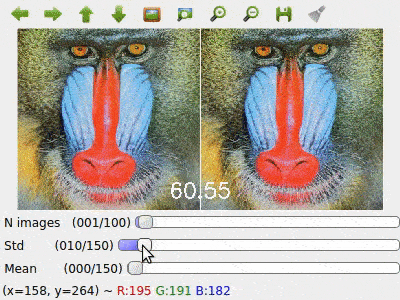

# Digital-Image-Examples

## Install
* [Anaconda](https://www.anaconda.com/download/)

``` sh
conda create -n pi python=3
conda activate pi
conda install -c conda-forge opencv matplotlib
conda install -c anaconda ipykernel jupyter
python -m ipykernel install --user --name pi --display-name "PI env"

pip install -r requirements.txt // toDo

jupyter notebook //(or jupyter lab)
```

### View Notebook in nbviewer
> [CH02](https://nbviewer.jupyter.org/github/CarlosPena00/Digital-Image-Processing-Hands-On/blob/master/notebooks/chapter02.ipynb)

### Example
* CH02 - Noise



### Scripts


```
python scripts/chapter02-color_quantization.py -i data/Lenna.png
python scripts/chapter02-noise_removal.py -i data/Lenna.png
```
